# Ciclo completo — mapa de skills + grill-me

Fluxo visual do Head de Produto: [`docs/fluxo-head-produto-devin.html`](../../docs/fluxo-head-produto-devin.html)

Modelo 02↔03↔04: [modelo-experimentacao-discovery.md](./modelo-experimentacao-discovery.md)

```mermaid
flowchart TB
  subgraph F01["01 Contexto"]
    P1[/sync-okr pull/]
    A1[/draft-okr/]
    GM1[/grill-me okr-draft/]
    DO[/desdobrar-okr/]
    GM1b[/grill-me okr-cascata/]
    A2[/auditar-okr/]
    GM1c[/grill-me gate-01/]
    P2[/sync-okr push/]
  end
  subgraph F02["02 Discovery — Head GTM"]
    VM[/visao-mercado/]
    VP[/visao-produto/]
    VC[/visao-cliente/]
    SV[/sintetizar-visoes/]
    GM2a[/grill-me oportunidades/]
    GH[/gerar-hipoteses/]
    GM2b[/grill-me hipoteses/]
    SVM[/testar-svm/]
    GM2c[/grill-me svm/]
    PF[/prototipo-figma/]
    GM2d[/grill-me prototipo/]
    FS[/feature-stories/]
    GM2e[/grill-me feature + gate-02/]
  end
  subgraph F03["03 Experimentação — clientes reais"]
    EB[/experiments-backlog/]
    DE[/design-experimento/]
    GM3a[/grill-me experimento/]
    RR[/registrar-resultado/]
    DC[/decidir-experimento/]
    GM3b[/grill-me decisao-exp + gate-03/]
  end
  subgraph F04["04 Construção — SDD + CI/CD"]
    SF[/spec-funcional/]
    GM4a[/grill-me spec-funcional/]
    SNFR[/spec-nao-funcional/]
    ST[/spec-tecnica/]
    DT[/decompor-tarefas/]
    GM4b[/grill-me tarefas/]
    IMP[/implementar-tarefa/]
    RP[/review-pr/]
    GM4c[/grill-me gate-04-pre/]
    CI[/ci-validar/]
    GM4d[/grill-me ci/]
    PREP[/prep-release/]
    GM4e[/grill-me release/]
    CDS[/cd-promover sandbox/]
    CDH[/cd-promover homolog/]
    GM4f[/grill-me cd-homolog/]
    CDP[/cd-promover producao/]
    RC[/rollout-canario/]
    VH[/validar-rollout-head/]
    GM4g[/grill-me rollout-head/]
    EXP[/rollout-expandir ou rollback/]
    GM4h[/grill-me gate-04/]
  end
  subgraph F05["05 Operação"]
    E1[/review-metricas/]
    GM5a[/grill-me metricas/]
    E2[/postmortem/]
    E3[/insight-para-discovery/]
    GM5b[/grill-me insights/]
  end

  START[/orquestrar-producao/] --> P1
  P1 --> A1 --> GM1 --> DO --> GM1b --> A2 --> GM1c --> P2
  P2 --> H12[/curar-contexto 01 02/]
  H12 --> VM & VP & VC
  VM & VP & VC --> SV --> GM2a --> GH --> GM2b --> SVM --> GM2c --> PF --> GM2d --> FS --> GM2e
  GM2e --> H23[/curar-contexto 02 03/]
  H23 --> EB --> DE --> GM3a --> RR --> DC --> GM3b
  GM3b -->|scale| H34[/curar-contexto 03 04/]
  GM3b -->|iterate pivot kill| H32[/curar-contexto 03 02/]
  H34 --> SF --> GM4a --> SNFR --> ST --> DT --> GM4b --> IMP --> RP --> GM4c --> CI --> GM4d --> PREP --> GM4e --> CDS --> CDH --> GM4f --> CDP --> RC --> VH --> GM4g --> EXP --> GM4h
  GM4h --> H45[/curar-contexto 04 05/]
  H45 --> E1 --> GM5a --> E2 --> E3 --> GM5b
  GM5b --> H52[/curar-contexto 05 02/]
  H52 --> VP

  GOV[/governanca-check/] -.-> F01
  GOV -.-> F02
  GOV -.-> F03
  GOV -.-> F04
```

## Handoffs entre favos

| De | Para | Quando |
|----|------|--------|
| 01 | 02 | Gate 01 + grill `gate-01` |
| 02 | 03 | Gate 02 — feature **candidata** (`validacao_real: pendente`) |
| 03 | 04 | Gate 03 — decisão **`scale`** + `validacao_real: confirmada` |
| 03 | 02 | `iterate` / `pivot` / `kill` |
| 04 | 05 | Gate 04 + grill `gate-04` |
| 05 | 02 | Insights + grill `insights` |

## Ordem crítica favo 04

`implementar` → **`review-pr`** → `ci-validar` → `prep-release` → CD (sandbox → homolog → prod hash) → canário → validação Head → expandir/rollback

## Runtime paths

| Path | Conteúdo |
|------|----------|
| `colmeia/*/_iniciativas/{id}/` | Artefatos por favo |
| `colmeia/_handoffs/` | Handoffs entre favos |
| `colmeia/_grill/{id}/` | Interrogatórios grill-me |

## Regra grill-me

Toda seta **skill → grill → próxima skill**. Se veredito `BLOQUEAR` ou `REFINAR`, o Head decide: voltar skill anterior ou abortar gate.
