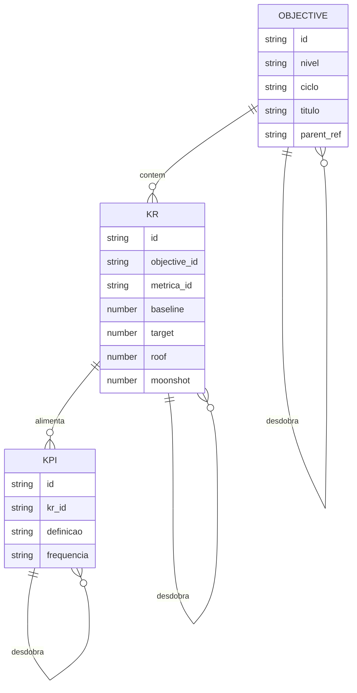
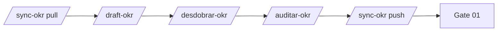

# Modelo OKR — desdobramento e plataforma de acompanhamento

Contrato de domínio para o favo 01. Skills e tools devem falar este vocabulário.

## Propósito

Permitir **desdobramento em cascata** (todos os níveis organizacionais) e **acompanhamento contínuo** de metas com quatro pontos de referência por indicador: baseline, target, roof e moonshot — via **Plataforma OKR** (tool externa configurada pelo operador).

## Hierarquia organizacional (níveis)

Níveis padrão — ajustáveis em `colmeia/_config/okr-plataforma.md`:

| Nível | Código | Papel no desdobramento |
|-------|--------|------------------------|
| Empresa | `L0` | Objectives corporativos; fonte da cascata top-down |
| Diretoria | `L1` | Contribuição à empresa; alinha portfólio |
| Comunidade / BU | `L2` | Contribuição à diretoria; dono de squads |
| Squad / Produto | `L3` | OKR operacional da iniciativa `{id}` |
| Time (opcional) | `L4` | Desdobramento fino dentro do squad |

**Regra:** todo nó filho deve ter `parent_ref` apontando para KR, KPI ou Objective do nível imediatamente superior.

## Entidades



### Objective (OKR)

- **O quê:** outcome qualitativo do nível no ciclo
- **Dono:** papel organizacional (não preencher nome de pessoa no framework)
- **Campos mínimos:** `id`, `nivel`, `ciclo`, `titulo`, `parent_ref?`, `tipo_alinhamento`

### Key Result (KR)

- **O quê:** resultado mensurável que prova progresso do Objective
- **Campos de meta (obrigatórios na plataforma):**

| Campo | Significado | Uso na skill |
|-------|-------------|--------------|
| **baseline** | Valor de partida no início do ciclo | Ponto zero; não confundir com target |
| **target** | Meta comprometida do ciclo | KR “atingido” quando ≥ target (ou ≤ se métrica inversa) |
| **roof** | Teto realista de excelência no ciclo | Stretch operacional; acima do target |
| **moonshot** | Aspiração máxima, baixa probabilidade | Ambição; não entra em compromisso de bônus por default |

**Regra de coerência (auditor):**

```
baseline ≤ target ≤ roof ≤ moonshot   (métricas “maior é melhor”)
baseline ≥ target ≥ roof ≥ moonshot   (métricas “menor é melhor”, ex.: custo, tempo)
```

Se ordem violada → código de rejeição `OKR-MET-02`.

### KPI

- **O quê:** indicador de acompanhamento (leading/lagging) que **alimenta** um ou mais KRs
- **Diferença de KR:** KPI pode ser contínuo (semanal/mensal); KR é compromisso do ciclo
- **Campos:** mesmos quatro pontos (baseline, target, roof, moonshot) quando a plataforma suportar; senão herdar do KR pai

## Desdobramento (cascata)

### Tipos de vínculo

| Tipo | Código | Descrição |
|------|--------|-----------|
| Contribuição direta | `contribui` | KR filho move o KR pai (peso explícito) |
| Habilita | `habilita` | Filho é pré-requisito, não soma linear |
| Espelho | `espelha` | Mesma métrica, outro nível (evitar duplicar sem peso) |

### Modos por `tipo_iniciativa`

| tipo_iniciativa | Objective no squad (L3) | KRs |
|-----------------|-------------------------|-----|
| `core` | Herdado do L2 — não reescrever | Desdobrar só KRs com peso na contribuição |
| `exploratorio` | Proposto no L3 — validar no L2 | KRs novos; link `habilita` ao pai |
| `hibrido` | Herdado | Mix: KRs core + KR exploratório marcado |

### Algoritmo da skill `/desdobrar-okr`

1. Ler nó pai (fornecido ou puxado da Plataforma OKR via `/sync-okr-plataforma pull`)
2. Listar KRs/KPIs do pai aplicáveis à iniciativa `{id}`
3. Para cada KR pai, propor 1..n KRs filho com:
   - `parent_ref`, `tipo_vinculo`, `peso` (0–1 ou %)
   - baseline/target/roof/moonshot **coerentes** com o pai (soma de contribuições ≤ 100% quando linear)
4. Gerar `okr-cascata.{yaml|json}` + atualizar `okr-{ciclo}.md`
5. Não publicar na plataforma sem passo explícito `sync push`

### Artefato canônico de desdobramento

Arquivo: `okr-cascata.yaml` — schema em [artefatos.md](./artefatos.md).

## Plataforma OKR (tool)

### Papel no modelo

**Sistema de registro** para todos os níveis: consulta, desdobramento, acompanhamento e histórico de baseline/target/roof/moonshot.

O framework **não substitui** a plataforma — sincroniza com ela.

### Capacidades da tool (contrato MCP/API)

| Capacidade | Operação | Skill que consome |
|------------|----------|-------------------|
| `okr.read_tree` | Árvore OKR/KR/KPI por ciclo e nível | `desdobrar-okr`, `draft-okr` |
| `okr.read_node` | Um nó + metas | `auditar-okr` |
| `okr.upsert_objective` | Criar/atualizar Objective | `sync-okr-plataforma push` |
| `okr.upsert_kr` | Criar/atualizar KR + 4 metas | `sync-okr-plataforma push` |
| `okr.upsert_kpi` | Criar/atualizar KPI | `sync-okr-plataforma push` |
| `okr.link_parent` | Definir `parent_ref` e tipo vínculo | `desdobrar-okr` |
| `okr.progress` | Valor atual vs baseline/target/roof/moonshot | `review-metricas` (favo 05) |
| `okr.checkin` | Registrar check-in de ciclo | operador / favo 05 |

Configuração: `colmeia/_config/okr-plataforma.md` (MCP server id, níveis habilitados, regras de soma).

### Fluxo integrado favo 01



## North Star e inputs

- North Star do squad = **KR ou KPI** de nível L3 marcado `is_north_star: true` na plataforma
- Métricas input do discovery = KPIs `leading` ligados ao North Star

## Integração com favos downstream

| Favo | Uso da plataforma |
|------|-------------------|
| 02 Discovery | OST outcome = `objective_id` ou `kr_id` referenciado |
| 03 Experimentação | Hipóteses ligadas a KR com baixa confiança no target |
| 05 Operação | `okr.progress` alimenta `/review-metricas` |

## Códigos de auditoria (extensão)

| Código | Condição |
|--------|----------|
| OKR-CAS-01 | Filho sem `parent_ref` |
| OKR-CAS-02 | Soma de pesos `contribui` > 100% no mesmo pai |
| OKR-MET-01 | baseline/target/roof/moonshot ausente em KR na plataforma |
| OKR-MET-02 | Ordem incoerente das quatro metas |
| OKR-SYNC-01 | Markdown local diverge da árvore na plataforma pós-push |
