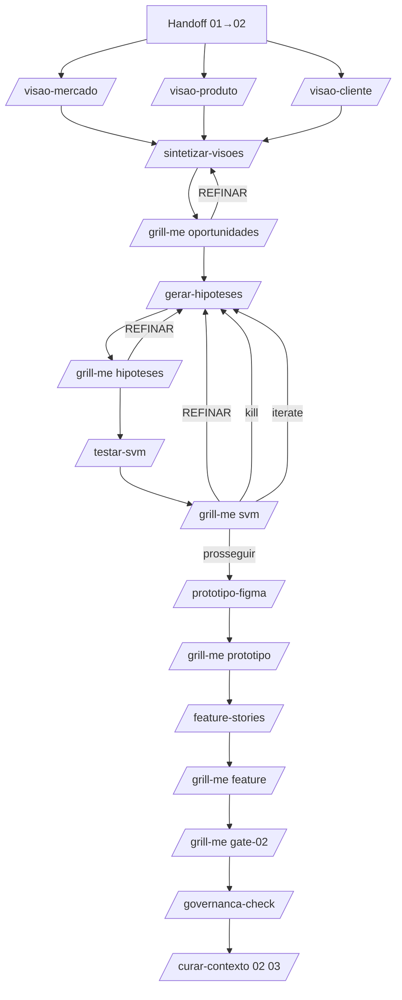

# Fluxo — Invocação de skills (favo 02)

Modelo: [modelo-discovery.md](./modelo-discovery.md) · Tools: [capacidades-tools.md](./capacidades-tools.md)

## Diagrama

## Passos

| # | Skill | Pré-condição | Output |
|---|-------|--------------|--------|
| 1 | Ler handoff 01→02 | Gate 01 | — |
| 2 | `/visao-mercado {id}` | KR/KPI ref do OKR | `visao-mercado.md` |
| 3 | `/visao-produto {id}` | Conexão analytics OK ou dados do operador | `visao-produto.md` |
| 4 | `/visao-cliente {id}` | Tools VOC OK ou dados do operador | `visao-cliente.md` |
| 5 | `/sintetizar-visoes {id}` | 3 visões | `oportunidades.md`, `ost-{id}.md`, `mapa-evidencias.md` |
| 5b | `/grill-me {id} oportunidades` | Síntese | `colmeia/_grill/{id}/grill-oportunidades-*.md` |
| 6 | `/gerar-hipoteses {id}` | Grill oportunidades ≠ BLOQUEAR | `hipoteses.yaml` |
| 6b | `/grill-me {id} hipoteses` | Hipóteses geradas | Grill — **crítico** (≥8 perguntas) |
| 7 | `/testar-svm {id} [hip]` | Grill hipóteses ≠ BLOQUEAR | `personas-sinteticas.yaml`, `svm-{hip}.md` |
| 7b | `/grill-me {id} svm` | SVM concluído | Valida `[SINTÉTICO]` e força do Strong |
| 8 | Decisão Head sobre cada hipótese | Grill svm | Atualiza `hipoteses.yaml` (status) |
| 9 | `/prototipo-figma {id}` | ≥ 1 hipótese SVM=Strong | `prototipo-spec.md` |
| 9b | `/grill-me {id} prototipo` | Protótipo spec | Escopo vs hipótese |
| 10 | `/feature-stories {id}` | Grill prototipo ≠ BLOQUEAR | `feature-{id}.md`, `historias.yaml` |
| 10b | `/grill-me {id} feature` | Feature gerada | Histórias por valor |
| 10c | `/grill-me {id} gate-02` | Feature + grills anteriores | Veredito final pré-gate |
| 11 | `/governanca-check {id} 02` | Condicional | Checklist |
| 12 | Gate 02 + `/curar-contexto 02 03 {id}` | Grill gate-02 ≠ BLOQUEAR | handoff |

## Skills paralelas

Os passos 2–4 (visões) são **paralelizáveis** — cada visão usa subagente próprio. A síntese (passo 5) é o ponto de junção.

## Cadência sugerida (parâmetro)

- Visões: refresh **mensal** (ou quando KR move >10%)
- Hipóteses: rolling (sempre que síntese mudar)
- SVM: rolling — cada hipótese passa antes de virar protótipo
- Feature stories: 1 entrega por ciclo de discovery (= 1 Gate 02)

## Anti-padrões

- Ir para hipótese sem 3 visões → `DIS-VIS-01`
- Visão sem segmentação → `DIS-VIS-02`
- Hipótese direto para protótipo sem SVM → `DIS-SVM-01`
- Apresentar SVM como teste real → `DIS-SVM-02`
- Histórias agrupadas por componente técnico → `DIS-STORY-01`

## Loop com favo 05

`/insight-para-discovery {id}` (favo 05) deposita evidências **diretamente nas visões** (Produto ou Cliente) — re-rodar `/sintetizar-visoes` para reavaliar.

## Falhas

| Situação | Ação |
|----------|------|
| Sem OKR (Gate 01) | Abortar → favo 01 |
| Tool VOC/analytics indisponível | Marcar `[DADO AUSENTE]` por canal; não invent |
| SVM com confiança baixa em todas hipóteses | Voltar para visões — sinal de evidência fraca |
| Protótipo sem hipótese referenciada | `DIS-FIG-01` |
