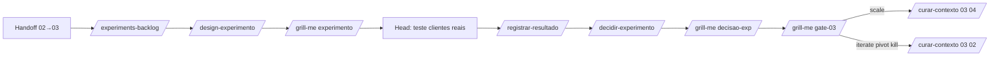

# Fluxo — Experimentação (favo 03)

Entrada: **feature candidata** + `hipoteses.yaml` + `prototipo-spec` (Gate 02) — não apenas OST.

## Passos

| Step | Skill | Output |
|------|-------|--------|
| 1 | Handoff 02→03 | feature + hipóteses + protótipo |
| 2 | `/experiments-backlog {id}` ou via `design-experimento` | `experiments-backlog.md` |
| 3 | `/design-experimento {id} [E]` | `experimento-{E}.md` ligado a `hipotese_ref` + histórias |
| 3b | `/grill-me {id} experimento` | — |
| 4 | Head executa com clientes reais | — |
| 5 | `/registrar-resultado {id} {E}` | atualiza experimento |
| 6 | `/decidir-experimento {id}` | `decisao-experimentos.md` + roteamento favo |
| 6b–c | grills `decisao-exp`, `gate-03` | — |
| 7 | Gate 03 + handoff conforme decisão | 03→04 se scale; 03→02 se iterate/pivot/kill |

## Tipos permitidos (Head)

| Tipo | Uso |
|------|-----|
| `entrevista` | Desejabilidade, linguagem |
| `prototipo` | Usabilidade (Figma) |
| `pretotype` | Demanda (fake door, smoke) |
| `ab` | Otimização com tráfego real |

`spike` **não** é experimento de produto — usar POC técnico no favo 04 se necessário.

## Falhas

| Situação | Ação |
|----------|------|
| Sem Gate 02 / feature | Abortar → favo 02 |
| scale sem atualizar feature `validacao_real` | EXP-04 |
