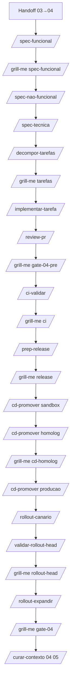

# Fluxo — SDD + CI/CD segregado + rollout (favo 04)

Modelos: [modelo-sdd.md](./modelo-sdd.md) · [modelo-ci-cd.md](./modelo-ci-cd.md) · [modelo-rollout.md](./modelo-rollout.md)

**Pré-requisito:** Gate 03 `scale` + `feature-{id}.md` com `validacao_real: confirmada`.

## Diagrama

## Passos

| # | Skill | Output |
|---|-------|--------|
| 1 | Handoff 03→04 + feature confirmada | — |
| 2 | `/spec-funcional {id}` | `spec-funcional`, `resumo-head` |
| 2b | `/grill-me {id} spec-funcional` | — |
| 3 | `/spec-nao-funcional {id}` | `spec-nfr-{id}.yaml` |
| 4 | `/spec-tecnica {id}` | `spec-tecnica-{id}.md` |
| 5 | `/decompor-tarefas {id}` | `tarefas.yaml` |
| 5b | `/grill-me {id} tarefas` | — |
| 6 | `/implementar-tarefa {id} {t}` | código no monorepo |
| 7 | **`/review-pr {id}`** | `review-pr-*.md` — **antes de CI/CD** |
| 7b | `/grill-me {id} gate-04-pre` | opcional: parecer PR |
| 8 | `/ci-validar {id}` | `ci-status`, `deploy-manifest-{hash}` |
| 8b | `/grill-me {id} ci` | — |
| 9 | `/prep-release {id}` | `release-plan`, `rollout-plan` |
| 9b | `/grill-me {id} release` | — |
| 10 | `/cd-promover {id} sandbox [hash]` | `cd-state` |
| 11 | `/cd-promover {id} homolog [hash]` | testes SV/mock |
| 11b | `/grill-me {id} cd-homolog` | — |
| 12 | `/cd-promover {id} producao [hash]` | `deploy_ref` |
| 13 | `/rollout-canario {id}` | canário |
| 14 | `/validar-rollout-head {id}` | `validacao-head` |
| 14b | `/grill-me {id} rollout-head` | — |
| 15 | `/rollout-expandir` ou `/rollout-rollback` | expansão ou rollback |
| 16 | `/grill-me {id} gate-04` + Gate 04 | handoff 05 |

## Falhas

| Situação | Código |
|----------|--------|
| Gate 03 não scale | Abortar → favo 03 |
| review-pr REPROVADO | BLD-PR-01 — não CI/CD |
| CI vermelho | CI-02 |
| Homolog falhou | CD-HOM-* |
| Expansão sem validação Head | ROL-01 |
