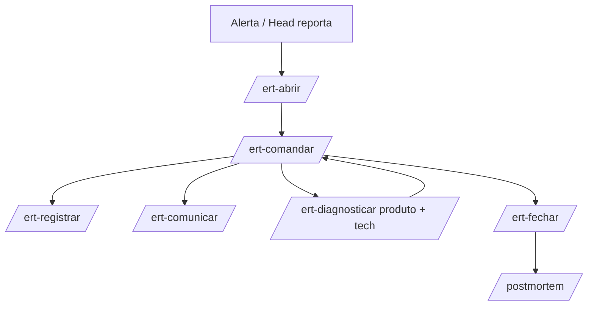

# Fluxo — Operação + ERT (favo 05)

Modelo ERT: [modelo-ert.md](./modelo-ert.md)

## Operação contínua

## Fluxo ERT (incidente)

## Passos ERT

| # | Skill | Output |
|---|-------|--------|
| 1 | `/ert-abrir {id} {ref}` | `incidentes/{ref}/incidente.yaml` |
| 2 | `/ert-comandar {id} {ref}` | `acoes.md` — plano de resposta |
| 3 | `/ert-registrar {id} {ref}` | `timeline.md` |
| 4 | `/ert-comunicar {id} {ref}` | `comunicacoes.md` |
| 5 | `/ert-diagnosticar {id} {ref}` | `visao-360.md` |
| 6 | Loop comandar até resolvido | — |
| 7 | `/ert-fechar {id} {ref}` | `fechamento.md` |
| 8 | `/postmortem {id} {ref}` | aprendizado |
| 9 | `/insight-para-discovery {id}` | loop 02 |

## Parâmetros

- Severidade e segmentos: operador ou alerta MCP
- Métricas: não inventar — `prod.*` ou `[DADO AUSENTE]`
