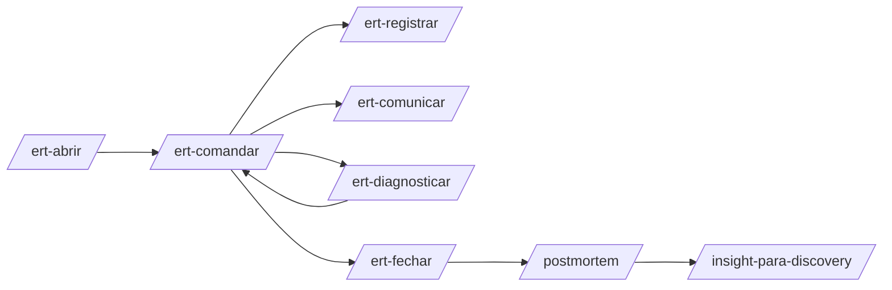

# Emergency Response Team (ERT) — operação 100% via IA

Incidentes e operação contínua executados por **skills + agentes**, com visão **360°**: cliente · produto · negócio · tecnologia (app + infra).

O Head de Produto pode ser notificado, mas a **execução operacional** é IA-orquestrada.

## Papéis

| Papel | Agent | Skill | Responsabilidade |
|-------|-------|-------|------------------|
| **Incident Commander** | `ert-lead` | `/ert-comandar` | Coordena, prioriza, decide status e próximos passos |
| **Logger** | `ert-logger` | `/ert-registrar` | Timeline imutável, evidências, links |
| **Communication Focal** | `ert-comm` | `/ert-comunicar` | Stakeholders, templates, cadência |
| **SME Produto** | `ert-sme-produto` | `/ert-diagnosticar produto` | Jornada, VOC, métricas discovery em incidente |
| **SME Tecnologia** | `ert-sme-tech` | `/ert-diagnosticar tech` | App, BFF, integrações, infra AWS |

Orquestração: `/ert-abrir {id}` → ativa squad; `/ert-fechar {id}` → encerra.

## Visão 360° (`visao-360-{incidente}.md`)

Gerada/atualizada por `/ert-diagnosticar`:

```markdown
# Visão 360° — incidente {ref}

## Cliente
- Segmentos afetados
- VOC / central (tópicos)
- Volume de clientes impactados

## Produto
- Jornadas / telas
- Funil, dead/rage click, loops (prod.*)
- Feature flags / rollout state

## Negócio
- KRs/KPIs em risco
- SLAs regulatórios
- Comunicação institucional necessária

## Tecnologia — aplicação
- Serviços: mobile, web-ssg, bff
- Integrações Sistema produto
- Deploy recente (link release favo 04)

## Tecnologia — infraestrutura
- Regiões AWS afetadas
- Alarmes, SLO, capacity
```

## Fluxo de incidente



## Artefatos runtime

```
colmeia/05-operacao/_iniciativas/{id}/incidentes/{ref}/
├── incidente.yaml
├── timeline.md          # Logger
├── comunicacoes.md      # Comm focal
├── visao-360.md
├── acoes.md             # Commander
└── fechamento.md
```

## Integração com discovery

Métricas `prod.*` e `voc.*` — mesma config de `discovery-tools.md`.

Rollout state de favo 04 — sempre consultar em incidentes pós-deploy.

## Operação contínua (não incidente)

| Skill existente | Função |
|-----------------|--------|
| `/review-metricas` | Saúde OKR |
| `/rollout-status` (favo 04) | Rollout em curso |
| `/insight-para-discovery` | Loop 02 |

## Códigos

| Código | Condição |
|--------|----------|
| ERT-01 | Incidente sem Commander designado |
| ERT-02 | Timeline sem atualização > SLA |
| ERT-03 | Comunicação sem aprovação Comm template |
| ERT-04 | Fechar sem visão 360° |
